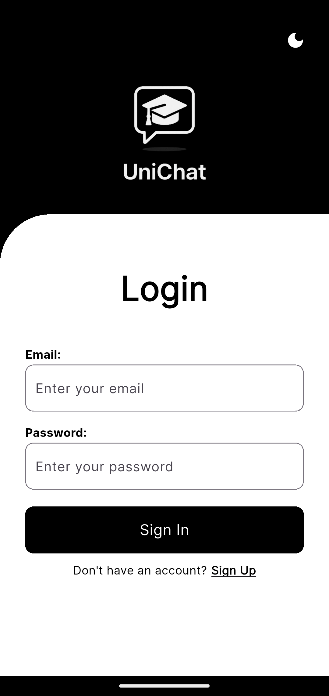
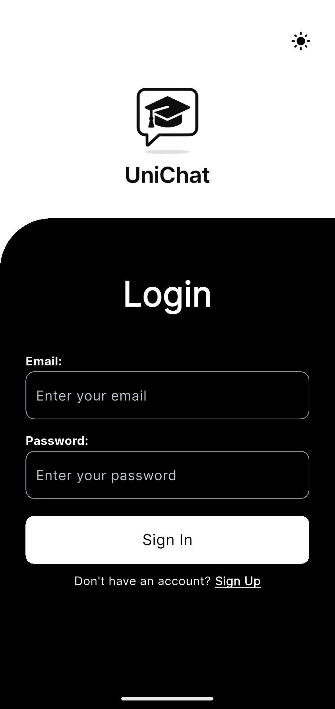
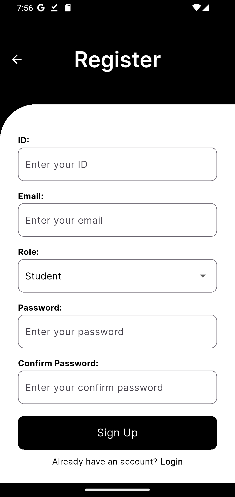
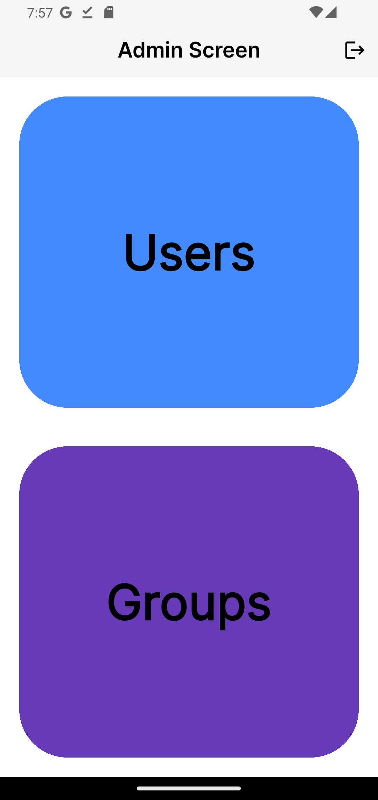
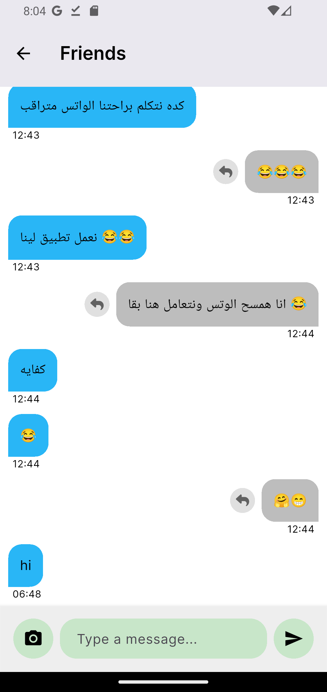
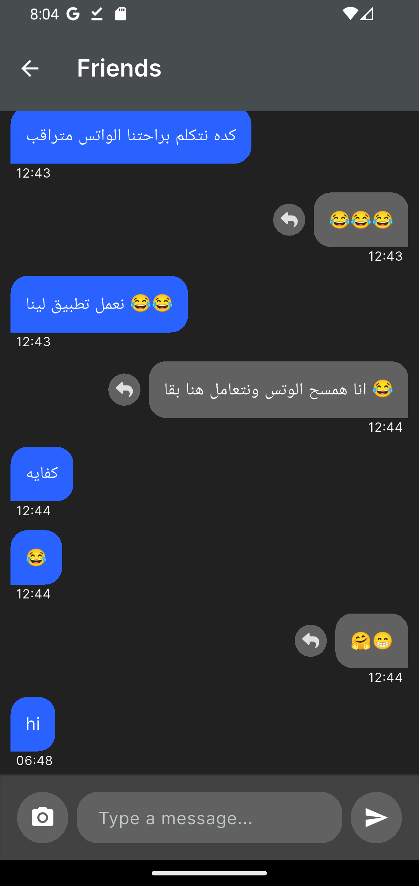
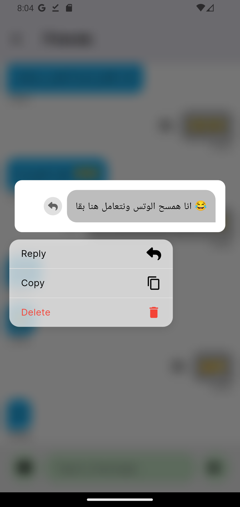
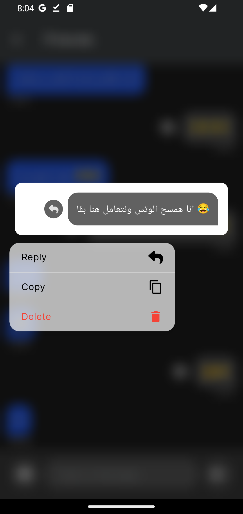

# UniChat 📱💬

**UniChat** is a modern Flutter mobile app designed to simplify and enhance university team communication.  
Built with a focus on anonymity, privacy, and organized collaboration, it helps students and professors connect, discuss, and manage academic content with ease.

---

## 🚀 Features

- 🔐 **Authentication** (Login / Register)
- 🌗 **Light / Dark Mode Switching**
- 🧑‍🏫 **Role-based Access** (Student, Admin, Professor)
- 📩 **Anonymous Group Messaging**
- 📎 **Attachments Library** for each subject
- 🗳️ **Group Voting System**
- 👥 **Group Join & Management**
- 🎨 Clean UI with theme customization
- 📤 **Image Upload** with Cloudinary API
- 🔄 Real-time Chat with Reply feature

---

## 🧠 Project Structure

> The full folder structure for the `lib/` directory can be found [here](./lib_folder_tree.md)

```bash
lib/
├── app/                  # App starter and widget wrapper
│   └── uni_chat.dart
├── build/                # Reusable Widgets (grouped by feature)
│   ├── account_widgets/
│   ├── admin_widgets/
│   ├── auth_widgets/
│   ├── chat_widgets/
│   ├── home_widgets/
│   ├── build_pages.dart
│   └── nav_bar_circle.dart
├── core/
│   ├── consts/           # Constants (colors, strings, etc.)
│   └── themes/           # App theme (light/dark)
├── models/               # Data models
│   ├── messageRegister.dart
│   ├── mode_model.dart
│   ├── selected_Index.dart
│   └── user_model.dart
├── screens/              # App Screens (UI pages)
│   ├── account/
│   ├── admins/
│   ├── auth/
│   ├── chat/
│   ├── home/
│   ├── settings/
│   └── splash/
├── services/             # Firebase and APIs
│   └── cloudinary_service.dart
├── providers/            # State management (Provider)
│   └── reply_provider.dart
└── main.dart

### Splash Screen  


### Login Screen  



### Register Screen  


### Admin Screen  


### Chat Interface  





# 1. Clone the repo
git clone https://github.com/a-e-kasem/UniChat.git

# 2. Navigate to the project directory
cd UniChat

# 3. Install dependencies
flutter pub get

# 4. Run the app
flutter run


---
